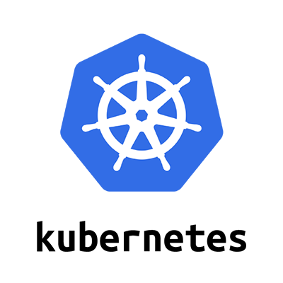

[Kubernetes またはk8s (k+8文字+s)](https://kubernetes.io/ja/)は、2014年にGoogleがオープンソースソフトウェア（以降、OSSと呼ぶ）として公開したコンテナをクラスター環境でオーケストレーションするためのツールです。

現在は、クラウドネイティブなテクノロジーのオープンソースプロジェクトを推進する[Cloud Native Computing Foundation(CNCF)](https://www.cncf.io/)によってKubernetes（以降、k8sと呼ぶ）プロジェクトがホストされています。

コンテナによって構築されるアプリケーションは、Web用コンテナ、DB用コンテナなど複数のコンテナによって構成されます。

また、これらのコンテナは可用性や負荷分散のために複数のサーバーにデプロイされる必要があります。

複数のコンテナを複数のサーバーにまたがってコンテナを手動でデプロイするには、以下のような点に注意しなければいけません。
- サーバーのリソース考慮
- コンテナのネットワーク
- データの管理
- スケーリング

このような複雑なコンテナの運用課題を解決するのがk8sです。

k8sを活用することで、上記に記述した課題をすべて自動化し解決することができます。

