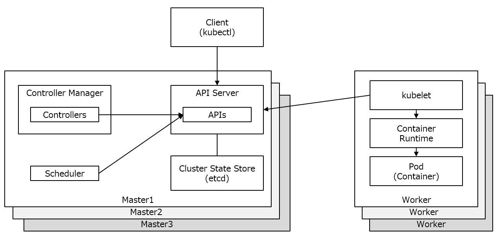

Kubernetesの内部コンポーネントを以下に示します。

Kubernetesの内部コンポーネントは、次の3つで構成されています。
 - Client compornent
 - Master compornents
 - Node compornents

##### Client Compoenent

[kubectl](https://kubernetes.io/docs/reference/kubectl/kubectl/)は、Kubernetesを管理するコマンドです。kube-apiserverに対してリクエストを送り、コンテナの作成や変更・取得・削除などを行います。

##### Master compornents

[Master components](https://kubernetes.io/docs/concepts/overview/components/#master-components)は、以下のコンポーネントによって構成されています。
- [API Server](https://kubernetes.io/docs/concepts/overview/components/)
- [Cluster State Store (etcd)](https://kubernetes.io/docs/concepts/overview/components/#etcd)
- [Controller Manager](https://kubernetes.io/docs/concepts/overview/components/#kube-controller-manager)
- [Scheduler](https://kubernetes.io/docs/concepts/overview/components/#kube-scheduler)

###### API Server

[API Server](https://kubernetes.io/docs/concepts/overview/components/#kube-apiserver)は、KubernetesのAPIを提供しているコンポーネントです。 kubectlから受け取ったリクエストを元にKubernetesのリソース制御を行います。他にも認証や認可の処理なども行っています。

###### Cluster State Store
Cluster State Store (etcd) は、複数のマシンで設定情報を共有することを目的とした分散KVS(Key Value Store)です。

###### Controller Manager
Controller Managerは、Kubernetesのオブジェクトを処理するコントローラを実行、管理するコンポーネントです。

###### Scheduler
Schedulerは、コンテナをNodeへスケジュールするコンポーネントです。Worker Nodeのリソースの使用率などをみて適切なNodeを1つ選択し、コンテナをNodeにデプロイします。

##### Worker compornents

[Worker compornents](https://kubernetes.io/docs/concepts/overview/components/#node-components)は、以下のコンポーネントによって構成されています

- [kubelet](https://kubernetes.io/docs/concepts/overview/components/#kubelet)
- [Container Runtime](https://kubernetes.io/docs/concepts/overview/components/#container-runtime)

###### kubelet
kubeletは、Podを起動、管理するエージェントです。SchedulerによってスケジュールされたPodをkubeletが認識して、そのPodを自身のNodeで起動させます。 また、実行しているPodの監視・管理も行います。

###### Container Runtime
Container Runtimeは、kubeletからの呼び出され、コンテナの実行をします。k8sでは、Container Runtimeとして以下を提供しています。
- [Docker](https://kubernetes.io/docs/setup/production-environment/container-runtimes/#docker)
- [CRI-O](https://kubernetes.io/docs/setup/production-environment/container-runtimes/#cri-o)
- [Containerd](https://kubernetes.io/docs/setup/production-environment/container-runtimes/#containerd)
