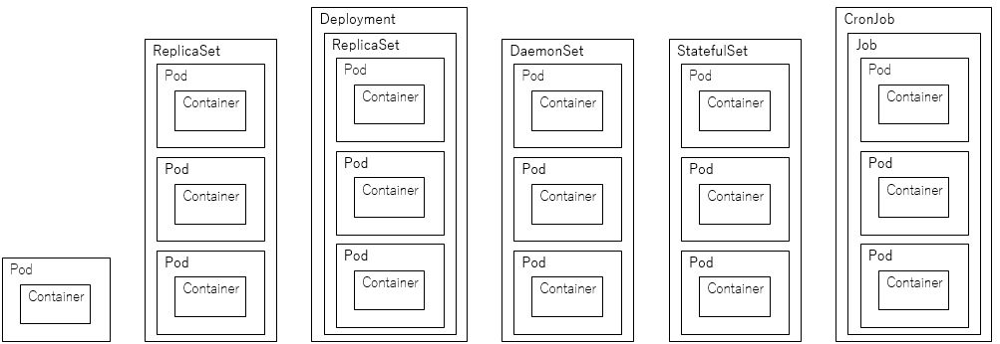

k8sでコンテナを動かすためには、以下の機能について理解する必要があります。

- Pod: コンテナを管理する最小単位
- ReplicaSet: 指定したPodの数の起動を維持する
- Deployment: Podのローリングアップデートなどを行う
- DaemonSet: 全てのnodeに1podの起動を維持する
- StatefulSet: Podの起動順序の制御などを行う
- Job: 一度限りの実行処理を行う
- CronJob: 定期実行処理を行う

各機能については、次のような図で表すことができます。

詳細は各章で紹介しますが、それぞれの機能が親子関係になっています。

例えば、Deploymentを例にとりますが、DeploymentがReplicasetを管理し、ReplicaSetがPodを管理する3層の親子関係になっています。

この親子関係は、k8sを理解するうえで非常に重要な概念となります。

各機能を理解するとともに合わせて意識しておく必要があります。

