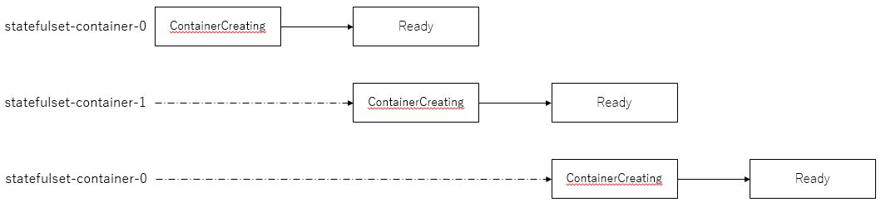

StatefulSetはステートフルな状態を扱う、データベースなどのワークロードに対応するリソースです。ReplicaSetに似ていますが、Podに対してPersistentVolumeを追加できる点やPod名にインデックスを付与することができます。

別の章で詳しく説明しますが、コンテナのデータは一時的なもので、Pod/コンテナが削除されればデータが消えてしまいます。また、コンテナが一時的な障害が発生してKubernetesが再起動させた場合も同様にデータが削除されます。これに対応した機能として、KubernetesではPodで保存したデータを保持する機能があります（また別の章で紹介します）。

簡単なDeploymentのサンプルを動作させます。まず下記のようなdeployment.yamlを作成します。

```execute
cat manifests/statefulset.yaml
```

各フィールドについては、次に説明しますが詳細は[こちら](https://kubernetes.io/docs/reference/generated/kubernetes-api/v1.16/#statefulset-v1-apps)をご覧ください。

- spec.serviceNameは、StatefulSetのPodを対象としているServiceの名前を指定する。このフィールドで指定されるServiceはStatefulSetが作成されるよりも先に作成される必要があります。

作成したマニフェストファイルからStatefulSetを作成してみましょう。kubectl applyコマンドを実行します。

```execute
kubectl apply -f manifests/statefulset.yaml
```

Podが起動しているかを確認してみます。確認方法は、kubectl get コマンドを実行します。STATUSがRunningとなっていれば正しく起動できています。replicasetとは異なり、statefulsetではインデックスが付与されています。

N個のレプリカをもったStatefulSetにおいて、StatefulSet内の各Podは、0からはじまりN-1までの整数値を順番に割り当てられます。

```execute
kubectl get pod
```

StatefulSetも、ReplicaSetと同様の方法でスケールすることができます。

Podスケーリング方法は、次の2つがあります。
- マニフェストファイルを編集し、kubectl apply コマンドを実行する
- kubectl scale コマンドを実行する

今回もReplicaSetの時と同様にkubectl scale コマンドを使用してスケールさせてみます。

```execute
kubectl scale statefulset statefulset-container --replicas=5
```

Pod数が変化することを確認します。

```execute
kubectl get pod
```

スケールアウトさせていく際は、インデックスが小さいものから順に1つずつPodを作成します。また、スケールインさせていく際は、インデックス番号が大きいものから順に1つずつPodを削除します。 StatefulSetのデフォルトの設定では、ReplicaSetなどとは異なり、複数のPodを並行して作成することはありません。ただし、StatefulSetでも同時にPodを並行してでさせることも可能です。



